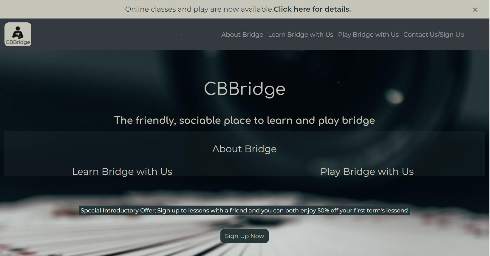

# **CBBridge Website**
This website is designed for a ficticious Bridge Club called CBBridge. Bridge is a popular card game played by many people but suffers from a poor image The idea was to promote the CBBridge club in a contemporary and user-friendly way and to recruit students and players.

[View the deployed site here](https://conacbreslin.github.io/CBBridge/)
## User Experience (UX)
A visitor to this page would be a person interested in learning bridge, or an existing bridge player looking for somewhere to play bridge. It is likely that prospective visitors might belong to an older age demographic and so the site was designed with this in mind.
On visiting the site they should be able to 
1. Understand the purpose of the site.
2. Understand the content/layout of webpage from the main page.
3. Easily navigate to find out information about Bridge in general.
4. Easily navigate to find out information on Bridge classes and sign up for them.
5. Easily navigate to information on Bridge play and sign up to play.
6. Easily navigate to the Contact form and send information from there.
7. Easily return to the main page from all sections.
## Strategy
A search of existing Bridge club websites shows there are very many bridge clubs with websites, but the vast majority are created with a generic template from an organisation called [bridgewebs.com](https://www.bridgewebs.com/). This provides a simple and easy way to create a webpage from a generic template which is tailored to the needs of most bridge clubs but has resulted in an overwhelming sameness of the sites and this bridge club wanted to create something different.
Following background research with both bridge players and non-bridge players [(see results here)](assets/pdfs/background-research.pdf). It was felt that the website needed to; 
- address the barriers to starting bridge,
- provide information on classes and the ability to sign up,
- providing information on play and the ability to signup.

In addition it was felt that the site would need interactive features to encourage visitors to engage with the site and return to the site in the future.
The websites opportunities to meet these needs and the feasibility of achieving them were quantified and plotted to help decide what would be included in the initial release [(see them here)](assets/pdfs/importance-feasibility.pdf)
Consequently the opportunities to be included in the first release included
- creating an online presence,
- addressing barriers to starting bridge,
- providing information on lessons/play,
 - providing an opportunity to recruit students and players	.

Objective Requirements;         The user will want to enrol in Bridge classes or Bridge play.

Functional requirements; 	    To achieve this the website will provide them with re information that takes into account the research findings and the site will include the ability to sign up to the club from the website.

Non functional requirements; 	The level of interactivity and complexity of the site will be limited by both the skill set of the person compiling the website and the likelihood that a significant proportion of people seeking bridge classes/play may be mature and may not have the technological skills of a younger demographic.

Business rule requirements;     The site will conform to data protection regulations
## Structure
As the quantity of information on the website was not extensive a single page linear structure was planned. Users are to be a given a navigation bar at the start and a return to home button as the page scrolls down. The contact/submission form should collect essential information and allow visitors to include their ability level and what they are interested in (classes, play or both).
## Skeleton
The page is to start with an alert banner and navigation bar followed by a hero image with immediate links to classes, play and sign up. This is followed by sections addressing each opportunity identified containing infomration and testamonials, and finally a form for signing up. Inspirational quotes are to be included between sections. The footer has additional information links, social media links and a map. These are laid out in three Balsamiq wireframes for [mobile](assets/wireframes/mobile-wireframe.png)
, [mediumscreens](assets/wireframes/medium-wireframe.png),  and [desktop](assets/wireframes/desktop-wireframe.png)
The site has a modal addressing the adaption of the club during COVID-19 restrictions.
## Surface/Design
### Imagery
The hero image was a key aspect of the site it was found in [unsplash.com](https://unsplash.com/) and was chosen to convey a contemporary, modern feel.
### Colour scheme
 [IMAGECOLORPICKER.com](https://imagecolorpicker.com/) was used to find the hex value of the backgound colour in the hero image and this was used in [coolor.co](https://coolors.co/) to generate [this colour palette](assets/images/colour-palette.png) which was felt to be contemporary and subtle.
### Typography
The Comfortaa font was selected in [Google Fonts](https://fonts.google.com/) for its clarity and contemporary feel and Google fonts suggested Montserrat as an accompanying font and its simplicity was appealing. The fallback font is Sans Serif.
## Features
- Responsiveness on all device sizes.
- The Alert banner disappears on small screens.
- The Navbar collapses and dismisses on tap on small screens.
- The homepage is clear with obvious links to all sections and conveys the image of a modern club that is also sociable and fun.
- The About Bridge Section gives a brief outline the game of bridge and provides links to more in-depth information. There are additional information paragraphs available on bigger screens.
- The Learn Bridge with Us section gives information on all aspects of CBBridge classes.
- The Play Bridge with Us section gives information on all aspects of CBBridge play sessions.
- The Sign Up section collects user information and allows the user to sign up, and has a Modal to alert visitor to changes due to Covid restrictions.
## Future features
In the future it would be anticipated that the site would;
- have less text in sections that can be truncated with an ellipsis and a ‘read more’ option, (scrollbars were not wanted on this release),
- make modal  appear only once per visit to site,
- make menu options dismiss on tapping logo when returning to home
- provide a members’ section that could be logged in to,
- provide an online discussion forum for bridge problems,
- ilnk to exisiting online bridge platforms like BridgeBaseOnline and RealBridge,
- provide interactive bridge hands and quizzes.

## Languages used
[HTML5](https://en.wikipedia.org/wiki/HTML5)

[CSS](https://en.wikipedia.org/wiki/CSS)
## Frameworks, Libraries and online resources used
- [Balsamiq](https://balsamiq.com/wireframes/) was used to create the wireframes.
- Gits's [gitpod](https://www.gitpod.io/) was used for writing and editing code, and for submitting and pushing to GitHub.
- [GitHub](https://github.com/) was used for storing the code after being pushed from Git.
- [Bootstrap 4.6.1](https://getbootstrap.com/) was used for responsiveness and styling.
- [jQuery](https://jquery.com/) came with Bootstrap for responsiveness.
- [Google Fonts](https://fonts.google.com/) was used to import the ‘Comfortaa’ and ‘Montserrat’ fonts into the style.css file.
- [zyro.com](https://logo.zyro.com)  was used to create the logo.
- [Font Awesome](https://fontawesome.com/) and [Bootstrap Icons](https://icons.getbootstrap.com/) was used to import the icons.
- Photos were used from [unsplash.com](https://unsplash.com/).
- Photos were used from [pexels.com](https://www.pexels.com/).
- [online-image-editor.com](https://www.online-image-editor.com/) was used to edit images.
- [tinypng.com](https://tinypng.com/) was used to resize images.
- Pixillion image conversion software from [nchsoftware.com](https://www.nchsoftware.com/imageconverter/index.html) was used to create the favicon.
- [101computing.net](https://www.101computing.net/html-how-to-add-a-favicon/) was used to help insert the favicon.
- The map and details for embedding were taken from [Google map](https://www.google.co.uk/maps/)
- code from [ourcodeworld.com](https://ourcodeworld.com/articles/read/307/how-to-create-a-responsive-table-with-css) was used to make the tables responsive.
- code from [css-tricks.com](https://css-tricks.com/perfect-full-page-background-image/) was used to import the background image. Vendor extensions were removed for this project.
- code from [codeply.com](https://www.codeply.com/go/PqIBtz3HPL) was used to create	dismiss-on-tap.
- [stackoverflow.com]() was consulted regularly for advice and for fixing for bugs.
- code was formatted using [webformatter.com](https://webformatter.com/html).
## Testing
### Validation.
The site’s html validation was tested by [validator.w3.org](https://validator.w3.org/). The errors identified and fixes are documented [here](assets/images/html-validator-testing.png).
The site’s css validation was tested by 
[jigsaw.w3.org](https://jigsaw.w3.org/css-validator/ttps://validator.w3.org/). The errors identified and fixes are documented [here](assets/images/jigsaw-testing.png).
### Lighthouse Audits
The site’s Performance, Accessibility, Best Practices and SEO were audited by 
[Chrome Lighthouse](https://chrome.google.com/webstore/detail/lighthouse/blipmdconlkpinefehnmjammfjpmpbjk) and the results of this and improvements made are documented [here](assets/images/lighthouse-log.png).
## Manual Testing
The Website was tested on Google Chrome, Internet Explorer, Microsoft Edge and Safari browsers.
It was viewed on a variety of devices. Links were tested repeatedly. Friends and family members were asked to review the site to help identify bugs and user experience issues. The code was submitted for peer-review in Code Institutes peer-code-review channel in [slack.com](https://app.slack.com/). The results of manual testing can be found [here](assets/images/manual-testing.png).
### Testing User Stories from User Experience (UX) Section.
1. Understand the purpose of the site
        - on entering the site the user is immediately greeted with a clean, uncluttered welcome page with an outline of all sections available and links to all sections.
        - the ethos and purpose of the club is summarised in the secondary heading
        - there is a button linking to the sign up form from the main welcome page.
2. Understand the content/layout of webpage from the main page.
    - the user can immediately see all the sections on the site on both the navbar and on the callout page links.
3. Easily navigate to find out information about Bridge in general.
    - there are links on both the navbar and from the content of the main page to enable the user to jump straight to the relevent section.
4. Easily navigate to find out information on Bridge classes and sign up for them.
    - there are links on both the navbar and from the content of the main page to enable the user to jump straight to the relevent section.
5. Easily navigate to information on Bridge play and sign up to play.
    - there are links on both the navbar and from the content of the main page to enable the user to jump straight to the relevent section.
6. Easily navigate to the Contact form and send information from there.
    - there are links on both the navbar and from the content of the main page to enable the user to jump straight to the relevent section.
    - the Sign Up form has a clear submission button.
    - required fields identify themselves to user before submmission is allowed.
    - on clicking the submission button a modal warns the user of adaptations to classes and play during Covid restrictions.
7. Easily return to the main page from all sections.
    - the sticky navbar allows the user to navigate to any area of the site from their current location.
## Changes over course of development
It was decided to use a sticky navbar which removed the need to 'return to top' buttons in all sections.

The modal was temporarily abandoned as the buttons included on it were complicating the submit procedure but it was then simplified and reinstated.

Labels were added to tables to indicate their swipeability.
## Known Bugs
There is a paragraph inside the iframe to advise users if their browser does not support it, validator.w3.org calls this an error as it says says  text is not allowed in the iframe.However Code Institute's teaching and [stackoverflow.com](https://stackoverflow.com/questions/13523260/javascript-and-iframe-not-supported-in-browsers-other-than-ie/13523382#13523382) say this is permitted.

When navigating on mobiles the navbar covers section headings, adding dimiss-on-tap improved but did not eliminate this issue.

The navbar does not display in scrolling on some Samsung devices.
## Deployment
### The project was deployed to GitHub Pages in the following way. 
1.	By logging in to the [GitHub Repository](https://github.com/)   
2.	Selecting the "Settings" Button in the menu at the top of the Repository.
3.	Scrolling down the Settings page to the "GitHub Pages" Section.
4.	Under "Source", clicking the dropdown menu labelled "None" and selecting "Master Branch".
5.	The page will refresh itself.
6.	Scrolling back down the page to locate the [link to the published site](https://conacbreslin.github.io/CBBridge/)  in "GitHub Pages".

### Forking the GitHub Repository
The  GitHub Repository can be forked to make a copy of the original repository on the GitHub account to view and/or make changes without affecting the original repository in the following way.
1.	By logging in to GitHub and locating the [GitHub Repository](https://github.com/ConacBreslin/CBBridge) 
2.	Selecting the "Fork" button at the top of the Repository (it is located above the "Settings" Button and over to the right).
3.	There should then be a copy of the original repository in your GitHub account.
Making a Local Clone
1.	By logging in to GitHub and locating the [GitHub Repository](https://github.com/ConacBreslin/CBBridge).
2.	Under the repository name, clicking the dropdown button marked “Code” and then selecting "Clone or download".
3.	To clone the repository using HTTPS, under "Clone with HTTPS", copying the link.
4.	Opening Git Bash.
5.	Changing the current working directory to the location where you want the cloned directory to be made.
6.	Typing git clone, and pasting the URL copied in Step 3.
7.	Pressing Enter to create the local clone.
## Credits
- Background image:	Photo by Jarosław Kwoczała on Unsplash.
- Lady-one photo: 	Photo by Kayla Farmer on Unsplash.
- Man-one Photo: 	Photo by Can yılmaz on Unsplash.
- Lady-two photo:  	Photo by Anderson Guerra from Pexels.
- Man-two photo; 	Photo by Italo Melo from Pexels.
## Content
All content was written by the developer.
## Acknowledgements
I would like to thank my mentor Chris Quinn for sound advice and support. 

I would like to thank many tutors in Code Institute for being unfailingly helpful and nice, in particular Alan, Mikos, Tim, Jo, Igor and Fatima. 

I would like to thank Stephen Seagrave for his [excellent presentation](https://us02web.zoom.us/rec/play/zZzrdRcJ1Gz9isoaRTUcHNhB1VEqzkhcI4kkOUXEbTGTShtMaNQEpxYE7dW214K5X2OWveSRPLL-oWtA.5EMQT2YvoO2ZLIox?autoplay=true) on MS1 projects that I consulted repeatedly.

Finally I would like to thank my family and friends for support and feedback and in particular the hilarious [comments about bridge](assets/pdfs/background-research.pdf) that always made me laugh!
